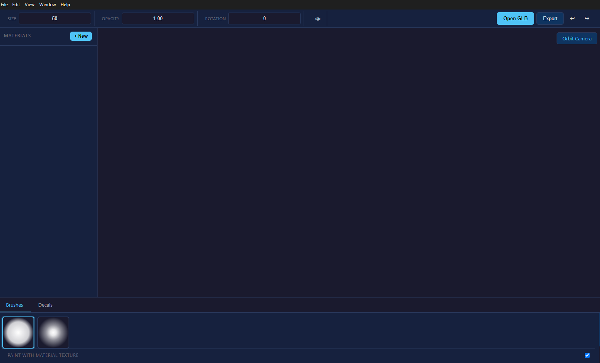

<p align="center">
  
</p>

<h1 align="center">MeshPaint</h1>

<p align="center">
  <strong>3D Mesh Texture Painting</strong><br>
  Paint textures directly on your 3D models in real time
</p>

<p align="center">
  <a href="https://github.com/itsdpr75/MeshPainter/releases/latest"></a>
  <a href="LICENSE"></a>
  <a href="#"></a>
</p>

---

## What is MeshPaint?

MeshPaint is a desktop application for painting textures directly on 3D meshes. Import GLB models, paint on their materials with configurable brushes, use other materials as paint (Texture Brush), place decals, and export the result as a new GLB file — all in real time.

Built with **Three.js** and **Electron**, using pure vanilla JavaScript.

## Features

- 🖌️ **3D Painting** — Paint directly on mesh textures with configurable brushes (size, opacity, rotation)
- 🎨 **Texture Brush** — Use any material's texture as paint, blending materials in real time
- 📦 **PBR Materials** — Full MeshPhysicalMaterial support: albedo, normal, roughness, metalness, specular, AO, displacement
- 🏷️ **Decals** — Drag & drop decals onto surfaces with W/E/R transform gizmos
- 📥 **Import/Export GLB** — Load GLB models (Draco compressed), export painted textures embedded in a new GLB
- ↩️ **Undo/Redo** — 100-state history for strokes and decal operations
- 🌙 **Dark UI** — Professional dark interface with material list, brush panel, and 3D viewport

## Tech Stack

| Component | Technology |
|-----------|-----------|
| Framework | Electron 33 |
| 3D Engine | Three.js 0.170 (WebGL 2) |
| Language | Vanilla JavaScript (ES Modules) |
| Build | electron-vite |
| Package Manager | pnpm |
| Packaging | electron-builder (NSIS) |
| Compression | Draco 1.5.7 |
| Format | glTF 2.0 (GLB) |

## Download

### Windows

| Type | Link |
|------|------|
| **Installer** | [MeshPaint Setup 1.0.0.exe](https://github.com/itsdpr75/MeshPainter/releases/download/v1.0.0/MeshPaint.Setup.1.0.0.exe) |
| **Portable** | [win-unpacked.7z](https://github.com/itsdpr75/MeshPainter/releases/download/v1.0.0/win-unpacked.7z) |

> Extract the portable archive and run `MeshPaint.exe` — no installation required.

## Development

### Prerequisites

- **Node.js** 18+
- **pnpm** 11+

### Setup

```bash
git clone https://github.com/itsdpr75/MeshPainter.git
cd MeshPainter
pnpm install
pnpm approve-builds --all
pnpm dev
```

This starts the Vite dev server with hot reload and opens the Electron window.

### Build

```bash
pnpm build          # Production build → out/
```

### Package for Windows

```bash
pnpm approve-builds --all   # First time only
pnpm dist                   # Build + NSIS installer → dist/
```

Output files:
- `dist/MeshPaint Setup 1.0.0.exe` — NSIS installer
- `dist/win-unpacked/MeshPaint.exe` — Portable executable

## Project Structure

```
src/
├── main/main.js              # Electron main process
├── preload/preload.js        # contextBridge API
└── renderer/
    ├── index.html / index.js # App entry, main loop
    ├── core/                  # Engine, SceneManager, InputManager, UVAnalyzer
    ├── camera/                # OrbitCamera, FreeCamera, CameraSwitcher
    ├── painting/              # Painter, PaintCanvas, PaintShader, Brush
    ├── materials/             # MaterialManager, PBRMaterial, MaterialModal
    ├── decals/                # DecalManager, DecalGizmo, DecalProjector
    ├── ui/                    # UIManager, BrushPanel, MaterialPanel, TopBar
    ├── workers/               # brush-processor, undo-snapshot, decal-math
    └── utils/                 # EventBus, UndoRedo, Constants, FileIO
docs/                         # Architecture, pipeline, modules, build docs
```

## Documentation

- [Architecture](docs/architecture.md) — Application architecture and data flow
- [Paint Pipeline](docs/paint-pipeline.md) — Step-by-step painting pipeline
- [Modules](docs/modules.md) — Module reference
- [Build & Run](docs/build-run.md) — Build, development, and packaging
- [Bug History](docs/bugs-fixes.md) — Bugs found and fixes applied
- [Complete Definition](docs/definition-document.md) — Exhaustive technical specification

## License

This project is licensed under the **GNU Affero General Public License v3.0 (AGPL-3.0)**. See [LICENSE](LICENSE) for details.

---

<p align="center">
  Made with Three.js & Electron
</p>
